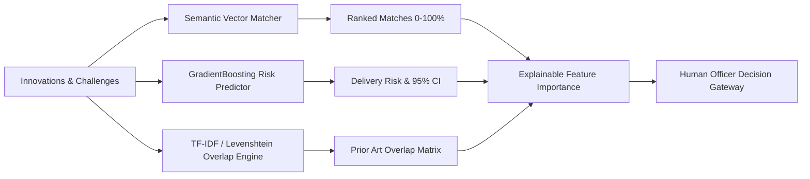
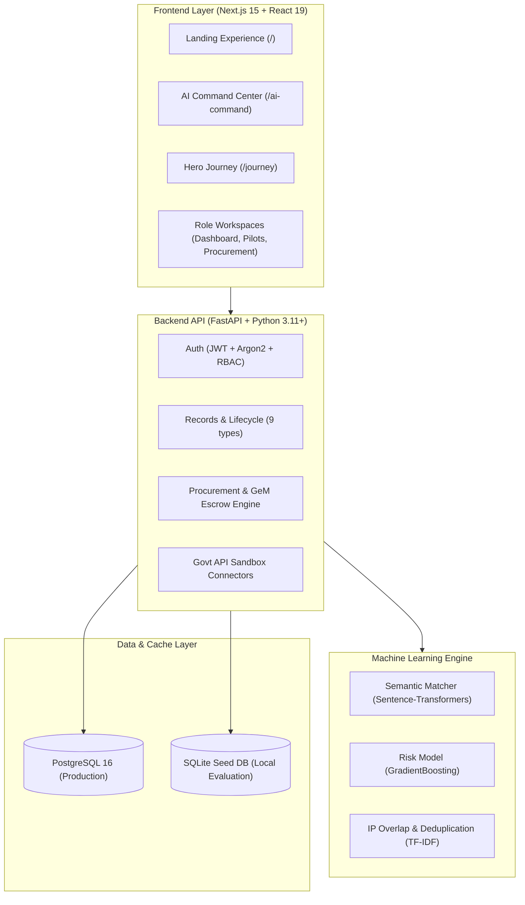

<p align="center">
  
  
  
  
  
  
  
  
  
</p>

# UdaanSetu (उड़ान सेतु)

### From Research to Impact
> *One idea. One journey. One ecosystem.*

**Smart India Hackathon 2026 · Problem Statement: SIH26136**  
*National Innovation Lifecycle & Startup-Friendly Public Procurement Platform*

---

<p align="center">
  <a href="#overview">Overview</a> ·
  <a href="#product-journey">11-Stage Journey</a> ·
  <a href="#ai-innovation-intelligence">AI Intelligence</a> ·
  <a href="#sih26136-public-procurement-highway">Procurement Highway</a> ·
  <a href="#technical-architecture">Architecture</a> ·
  <a href="#evaluator-demo-flow">Demo Guide</a> ·
  <a href="#testing--verification">Testing</a> ·
  <a href="#security--governance">Security</a> ·
  <a href="#documentation-suite">Docs</a>
</p>

---

## Overview

**UdaanSetu** is an evidence-based national innovation platform built for **Smart India Hackathon 2026 (SIH26136)**. It unifies academic research, high-growth startups, government department challenges, AI validation, pilot sandboxes, and government e-Marketplace (GeM) public procurement into a synchronized, transparent highway.

```
Research → Innovation → IPR → Funding → Startup → Govt Challenge → AI Match → Pilot → Validation → Escrow → Procurement → Scale → Impact
```

> **Transparency & Prototype Disclosure**: External government APIs (DigiLocker, Aadhaar eKYC, IP India, Startup India, ONDC) operate with simulated sandbox contracts for demonstration. All machine learning outputs function strictly as **explainable decision support**, requiring human officer review for consequential milestone releases and procurement allocations.

---

## Complete Documentation Suite

- **[System Architecture (docs/ARCHITECTURE.md)](docs/ARCHITECTURE.md)**: High-level topology, component diagrams, and data flows.
- **[API Reference Matrix (docs/API.md)](docs/API.md)**: Detailed endpoint catalog, auth rules, status codes, and schemas.
- **[AI/ML Engine & Explainability (docs/AI_ML.md)](docs/AI_ML.md)**: GradientBoosting risk models, TF-IDF / SBERT semantic matching, and duplicate clustering.
- **[Security & RBAC (docs/SECURITY.md)](docs/SECURITY.md)**: Argon2 hashing, JWT expiration, IDOR checks, upload hardening, and CORS whitelist.
- **[Deployment & Infrastructure (docs/DEPLOYMENT.md)](docs/DEPLOYMENT.md)**: Render blueprint (`render.yaml`), Docker Compose, and environment configuration.
- **[SIH Evaluator Demo Script (docs/DEMO.md)](docs/DEMO.md)**: Multi-role demo accounts, step-by-step presentation walkthrough, and trust badges.
- **[Data Integrity & Schemas (docs/DATA.md)](docs/DATA.md)**: Entity relationships, PostgreSQL schemas, and SQLite demo seed separation.
- **[Verified Test Execution (docs/TESTING.md)](docs/TESTING.md)**: 153/153 backend tests + 19/19 frontend tests + 30 static Next.js pages generated.
- **[Government Integration Boundaries (docs/INTEGRATIONS.md)](docs/INTEGRATIONS.md)**: Explicit prototype/mock declarations for DigiLocker, Aadhaar, IP India, Startup India, and ONDC.
- **[Limitations & Roadmap (docs/LIMITATIONS.md)](docs/LIMITATIONS.md)**: Known prototype boundaries and production scaling roadmap.
- **[Final SIH Readiness Audit (docs/PHASE6_FINAL_READINESS.md)](docs/PHASE6_FINAL_READINESS.md)**: Credential decoupling, zero-password bundle verification, and security audit.
- **[Final Release Gate Checklist (docs/FINAL_RELEASE_CHECKLIST.md)](docs/FINAL_RELEASE_CHECKLIST.md)**: Comprehensive release gates, command logs, and pre-merge checklist.

---

## Product Journey

UdaanSetu structures the entire innovation lifecycle into 11 verified milestone gates:

| # | Stage | Actor | Deliverable & Gate Criteria |
| :---: | :--- | :--- | :--- |
| **01** | **Research** | Researcher / Faculty | Lab prototype, peer-reviewed paper, provisional patent filing. |
| **02** | **Govt Challenge** | Department Officer | Problem brief, target KPIs, allocated district pilot budget. |
| **03** | **Discovery & Match** | UdaanSetu AI | Automated semantic & vector matching (&gt;70% similarity threshold). |
| **04** | **AI Validation** | ML Risk Engine | Multi-factor delivery risk score (&le;45%) and IP overlap clearance. |
| **05** | **Expert Evaluation** | Review Committee | Double-blind technical scoring panel (&ge;75/100 consensus score). |
| **06** | **Pilot Deployment** | Startup + Dept | Controlled district sandbox trial with baseline KPI collection. |
| **07** | **Validation** | 3rd-Party Validator | On-site performance audit and certified telemetry proof-of-value. |
| **08** | **Milestone Escrow** | Finance / Treasury | Automated escrow release triggered strictly by validator certification. |
| **09** | **Procurement** | Procurement Officer | GeM sandbox catalog onboarding with Rule 149 compliant direct purchase order. |
| **10** | **Statewide Scale** | State Mission | Expansion roadmap across 14+ Urban Local Bodies and districts. |
| **11** | **Public Impact** | Citizens & State | Quantified societal ROI: citizen lives touched, resources saved, SDG alignment. |

---

## AI Innovation Intelligence

The platform features native, production-tested machine learning pipelines:



1. **AI Smart Matcher**: Computes cosine and vector similarity (0–100%) between startup capabilities and department requirements.
2. **Predictive Risk Engine**: GradientBoosting regression estimating delivery delay risks across team capacity, milestone lag, and funding velocity.
3. **Duplicate & IP Overlap Detection**: Scans state innovation repositories and patent claim texts to flag prior art overlaps (preventing duplicate grants).
4. **Explainable AI (SHAP Weights)**: Deconstructs every score into contributing positive/negative feature bars (zero black-box scoring).
5. **Human-in-the-Loop Governance**: AI outputs serve strictly as decision support; no automated financial or procurement sanctions occur without officer signoff.

---

## SIH26136 Public Procurement Highway

Directly addressing the gap between startup innovations and public procurement:

```
[Challenge Brief] ➔ [AI Discovery] ➔ [Eligibility Filter] ➔ [Peer Review] ➔ [District Pilot] ➔ [Validator Proof] ➔ [Milestone Escrow] ➔ [GeM Direct PO] ➔ [Statewide Scale]
```

- **Rule 149 Alignment**: Bridges sandbox pilot certifications with direct purchase order eligibility under General Financial Rules (GFR).
- **Milestone Escrow Mechanism**: Funds disbursed in proof-backed tranches against validator verification certificates.
- **Auditable Provenance**: Append-only audit logging of all stage transitions, evaluations, and disbursements.

---

## Technical Architecture



- **Frontend**: Next.js 15 (App Router), React 19, TypeScript, Vanilla CSS Token Design System.
- **Backend**: FastAPI, Python 3.11+, SQLAlchemy ORM, Pydantic v2.
- **Database**: PostgreSQL 16 (Production / Docker), bundled SQLite (`udaansetu.db`) for instant offline demonstration.
- **Machine Learning**: Scikit-learn, Sentence-Transformers, NumPy, Pandas.
- **Security & Headers**: HSTS, CSP, X-Frame-Options DENY, X-Content-Type-Options nosniff, Rate Limiting (120 req/min).

---

## Evaluator Demo Flow

To evaluate the platform, follow the end-to-end **WaterLens Technologies** demonstration:

1. **Landing & Identity (`/`)**: Explore the 11-stage highway and problem statement context.
2. **Sign In (`#workspace`)**: Quick-select pre-configured demo profiles:
   - `Admin`: `admin@udaansetu.gov.in` (System governance & audit inspection)
   - `Govt Officer`: `rajesh.patil@maharashtra.gov.in` (Challenge posting & pilot oversight)
   - `Procurement Officer`: `meera.sharma@maharashtra.gov.in` (GeM purchase orders & escrow)
   - `Evaluator`: `vikram.patil@ieee.org` (Double-blind technical scoring)
   - `Validator`: `anjali.kulkarni@ncssc.in` (Field test certification)
   - `Researcher`: `arun.joshi@iitb.ac.in` (Lab research & patent filings)
   *(Note: Local passwords configured via seed script; refer to [docs/DEMO.md](docs/DEMO.md))*
3. **AI Command Center (`/ai-command`)**: Observe AI Match Score (94.2%), Risk Level (24/100 Low Risk), and explainable feature bars for *WaterLens Technologies*.
4. **Hero Journey (`/journey`)**: Walk through the 10-stage sequential lifecycle from *Smart Water Metering Challenge* to *Statewide Impact*.
5. **Procurement & Escrow (`/procurement`)**: Inspect GeM-aligned direct purchase orders and validator-triggered escrow payouts.
6. **Public Impact (`/impact`)**: View real-time SDG outcomes (12.4M L/day water conserved across 14 ULBs).

---

## Testing & Verification

```bash
# Backend Test Suite (Pytest)
python -m pytest backend/tests
# 153 passed / 153 total (Exit Code: 0)

# Frontend Test Suite (Vitest)
npm test (frontend)
# 4 test files passed, 19 tests passed (Exit Code: 0)

# Production Build & Prerendering (Next.js)
npm run build (frontend)
# 30 / 30 static pages compiled cleanly (Exit Code: 0)
```

---

## Security & Governance

- **Zero Bundled Credentials**: No passwords or private keys are bundled in client-side production assets.
- **Dynamic Secrets**: Deployment configs (`render.yaml`) utilize platform-managed runtime secret generation.
- **RBAC**: 7 distinct roles strictly enforce stage-specific permissions.
- **Rate Limiting**: 120 requests/minute per IP with health check exemptions.
- **Audit Trails**: Immutable append-only audit records with ISO 8601 UTC timestamps.

---

## Team & Attribution

Developed for **Smart India Hackathon 2026** under Problem Statement **SIH26136**.  
*Ministry / Department: Government of Maharashtra & National Innovation Ecosystem.*
