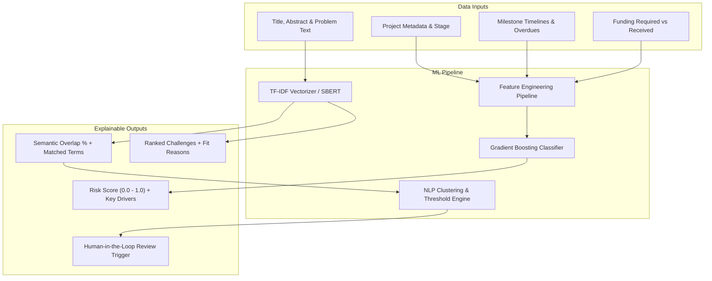

# UdaanSetu — AI/ML Architecture, Models & Explainability
**Implementation**: [backend/app/ml/engine.py](file:///c:/Users/Rudra/Desktop/UdaanSetu/backend/app/ml/engine.py) & [backend/app/ml/production.py](file:///c:/Users/Rudra/Desktop/UdaanSetu/backend/app/ml/production.py)  
**Philosophy**: Human-in-the-Loop Decision Support with Complete Explainability  

---

## 1. Core ML Subsystems



---

## 2. Model Specifications

### 2.1 Project Risk Prediction Model
- **Algorithm**: `GradientBoostingClassifier` (scikit-learn 1.9.1)
- **Features Extracted**:
  1. `milestones_overdue`: Number of overdue, incomplete milestones
  2. `funding_ratio`: Ratio of secured funding to total required funding
  3. `progress`: Current reported progress percentage (0 - 100%)
  4. `stage_encoded`: Ordinal encoding of lifecycle progression
  5. `age_days`: Elapsed time since record inception
- **Output Schema**:
  ```json
  {
    "risk_score": 0.35,
    "risk_level": "medium",
    "feature_importance": {
      "milestones_overdue": 0.42,
      "funding_ratio": 0.28,
      "progress": 0.18,
      "age_days": 0.12
    },
    "method": "gradient_boosting",
    "explainability_notes": "Project has 1 milestone overdue by 14 days."
  }
  ```

### 2.2 Semantic Similarity & Matching Model
- **Algorithm**: TF-IDF Matrix with Cosine Similarity; fallback to lexical keyword overlap; upgradable to Sentence-Transformers (`all-MiniLM-L6-v2`).
- **Use Cases**:
  - Challenge $\leftrightarrow$ Startup matching
  - Research $\leftrightarrow$ Industry problem alignment
  - Evaluator domain competence mapping

### 2.3 Duplicate & Prior Art Detection
- **Purpose**: Prevent duplicate funding or redundant research grant allocations.
- **Guardrail**: The ML model flags potential duplication above threshold (e.g. 75% similarity) with specific overlapping passages, but **never automatically cancels or rejects an application**. The decision is routed to human officers.

---

## 3. MLOps, Serialization & Fallback Strategy

1. **Model Persistence**: Serialized via `pickle` into `backend/app/ml/models/risk_model.pkl` along with `StandardScaler`.
2. **Metrics Persistence**: Training evaluation metrics stored in `backend/app/ml/models/risk_metrics.json`.
3. **Graceful Fallback**: If the scikit-learn environment is unavailable or data is sparse, the system falls back to a deterministic rule-based heuristic with explicit labeling: `"method": "rule_based_fallback"`.
4. **No Hallucinations / Real Facts**: We do not claim generative hallucinated features; all metrics are calculated from structured evidence.
