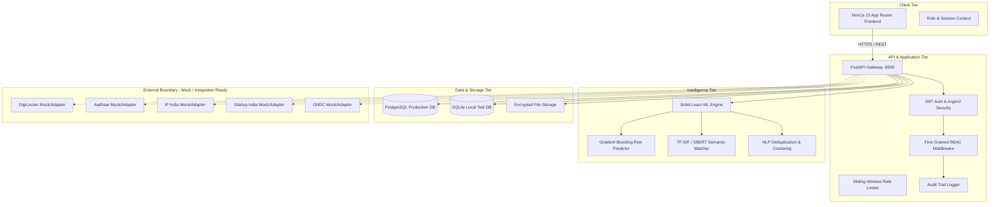
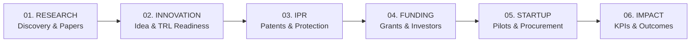

# UdaanSetu — System Architecture & Design
**Project Code**: SIH26136 / SIH26043  
**Architecture Style**: Decoupled Modular Service with Explainable AI Integration  

---

## 1. High-Level System Architecture

---

## 2. Six-Stage Innovation Journey Architecture

| Lifecycle Stage | Primary Entities | Backend Handlers | AI Support Role |
|---|---|---|---|
| **01. Research** | Papers, Datasets, Authors | `app.routes.records`, `app.routes.documents` | Semantic duplication analysis |
| **02. Innovation** | Problem Statements, TRL, Specs | `app.routes.challenges`, `app.routes.records` | Challenge-to-solution matching |
| **03. IPR** | Patent Filings, Prior Art, IP Agreements | `app.routes.ip_data_agreements`, `app.routes.documents` | Prior art overlap discovery |
| **04. Funding** | Grants, Schemes, Investor Profiles | `app.routes.payments`, `app.routes.records` | Grant eligibility alignment |
| **05. Startup** | Pilots, Milestones, Purchase Orders | `app.routes.pilots`, `app.routes.procurements`, `app.routes.purchase_orders` | Overdue risk & scale prediction |
| **06. Impact** | Beneficiaries, Scaling Metrics, Audits | `app.routes.scale_ups`, `app.routes.dashboard`, `app.routes.audit` | Aggregate risk & outcome analytics |

---

## 3. Technology Stack Breakdown

- **Frontend Core**: Next.js 15.5.7, React 18, TypeScript 5.9, Vanilla CSS variables, Recharts 2.15
- **Backend API**: Python 3.13, FastAPI 0.115.6, Uvicorn 0.34, Pydantic v2 Settings & Models
- **Database & ORM**: SQLAlchemy 2.0.36, Psycopg v3 (`postgresql+psycopg`), SQLite (test/local), Alembic migrations
- **Security**: PyJWT 2.10, pwdlib with Argon2 password hashing, python-multipart
- **Machine Learning**: scikit-learn 1.9.1, scipy 1.18.1, numpy 2.5, joblib 1.6, threadpoolctl 3.7
- **Deployment & Ops**: Docker multi-stage builds, Render Blueprint specification (`render.yaml`), Vercel edge deployment
