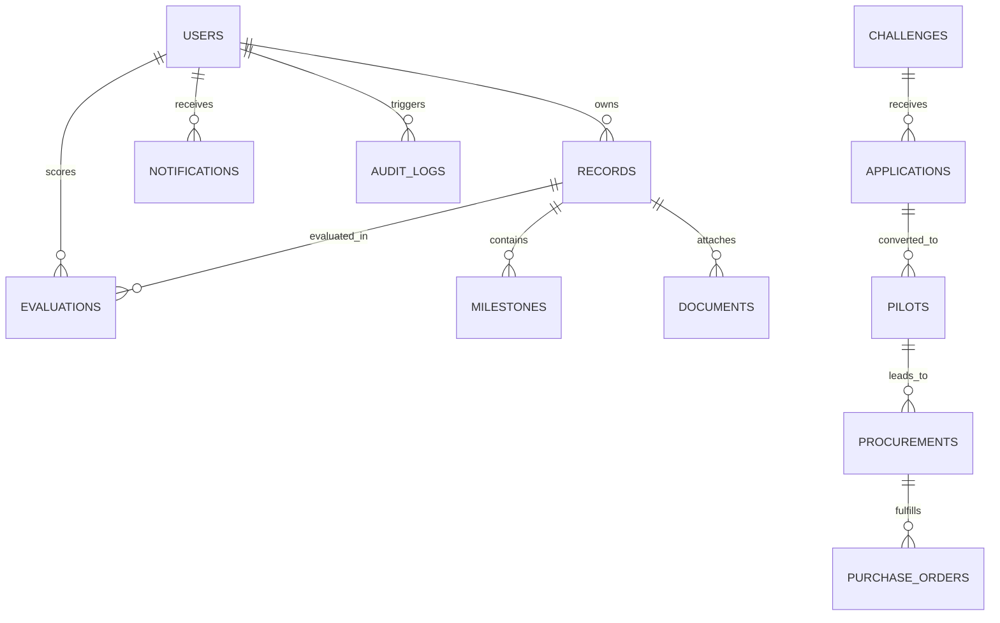

# UdaanSetu — Data Architecture, Schemas & Integrity

---

## 1. Entity Relationship & Data Model

The data layer models the entire startup-friendly public procurement and innovation lifecycle:

---

## 2. Real vs. Synthetic Data Separation

To ensure absolute transparency and credibility:

1. **Production Schemas**: Built on PostgreSQL with standard relations, foreign keys, timestamps, and indexes (`records`, `challenges`, `pilots`, `procurements`, `users`, `audit_logs`).
2. **Seed & Demonstration Dataset**: Pre-populated via [backend/app/seed.py](file:///c:/Users/Rudra/Desktop/UdaanSetu/backend/app/seed.py) with realistic Maharashtra districts (Pune, Mumbai, Nagpur, Nashik, Aurangabad, etc.) and sectors (GovTech, CleanTech, AgriTech, HealthTech).
3. **Data Labeling**: All synthetic/demo records in frontend analytics display a **Prototype / Demo Dataset** indicator to prevent misleading evaluators.

---

## 3. Data Integrity & Constraints

- **Foreign Key Enforcement**: All child tables (`milestones`, `applications`, `evaluations`) reference primary keys with indexed foreign keys.
- **Unique Constraints**: Unique indices on `users.email`, `records.code`, and `challenges.ref_no`.
- **Audit Immutability**: The `audit_logs` table is write-only for standard application routes. Deletion or tampering is restricted to database administrators.
- **Timezone Standardization**: All timestamps stored with UTC ISO 8601 formatting (`datetime.now(timezone.utc)`).
