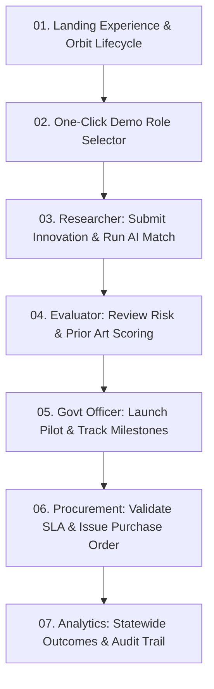

# UdaanSetu — Controlled SIH Demo Experience & Evaluation Flow
**Designed for**: Smart India Hackathon 2026 Jury & Live Demonstrations  

---

## 1. Demo Walkthrough Strategy

To present a compelling, defensible live demonstration to SIH evaluators, follow this recommended sequence through the complete 6-stage lifecycle:

---

## 2. Pre-Configured Demonstration Accounts

| Role | Email | Password | Primary Demo Responsibilities |
|---|---|---|---|
| **Admin** | `admin@udaansetu.gov.in` | `Admin@123` | System audit logs, ML model metrics, retraining triggers |
| **Govt Officer** | `rajesh.patil@maharashtra.gov.in` | `Govt@123` | Challenge posting, pilot authorization, department oversight |
| **Procurement Officer**| `meera.sharma@maharashtra.gov.in` | `Procure@123` | Tender creation, validation evaluation, purchase orders |
| **Evaluator** | `vikram.patil@ieee.org` | `Eval@123` | Independent scoring, technical reviews, conflict declarations |
| **Validator** | `anjali.kulkarni@ncssc.in` | `Valid@123` | Pilot validation reports, field tests, SLA certificates |
| **Auditor** | `suresh.jogani@cag.gov.in` | `Audit@123` | Financial audit inspection, compliance verification |

---

## 3. Step-by-Step Live Demo Script

### Step 1: Landing Page & Problem Context (30 seconds)
- Navigate to `/`
- Highlight the **Innovation Orbit Animation** displaying the 6 stages: *Research $\to$ Innovation $\to$ IPR $\to$ Funding $\to$ Startup $\to$ Impact*.
- Point out the trust badge: *"Demo data clearly labelled · Mock government integrations · Human review preserved"*.

### Step 2: One-Click Demo Sign-in (15 seconds)
- Click **"Open workspace"** or **"Launch demo"**.
- Use the quick account switcher buttons to instantly populate and authenticate as any desired role.

### Step 3: AI-Driven Decision Support (1 minute)
- Navigate to `/innovations` or `/research`.
- Open an innovation record (e.g. *Solar Smart Grid Sensor*).
- Demonstrate the **AI Risk Assessment**: show the calculated risk score (0.24 - Low Risk) with exact driving factors (0 overdue milestones, 85% funding ratio).
- Demonstrate **Smart Matching**: show recommended government challenges matching the innovation keywords.
- Demonstrate **Overlap / Duplicate Detection**: explain how potential overlaps are surfaced for human officers rather than blindly blackboxing approvals.

### Step 4: Pilot & Procurement Journey (1 minute)
- Switch to **Govt Officer** / **Procurement** role.
- Open `/pilots` to view milestone-based execution.
- Show SLA tracking, automated alerts for milestone breaches, and independent validation by testing agencies.
- Move to `/procurement` to view the auditable contract generation.

### Step 5: Statewide Impact & Audit Trail (45 seconds)
- Navigate to `/analytics` to show district-wise innovation distribution across Maharashtra.
- Navigate to `/audit` (Admin only) to show the immutable audit trail (`WHO`, `WHAT`, `WHEN`, `BEFORE/AFTER`).
