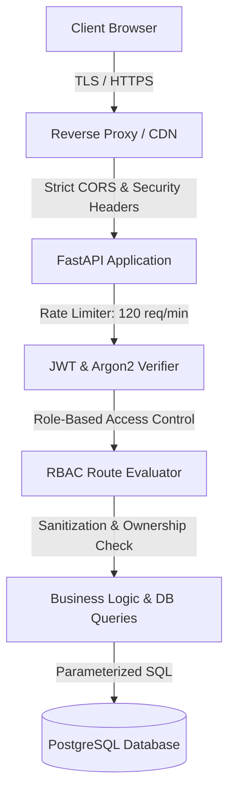

# UdaanSetu — Security Architecture & Hardening Guide

---

## 1. Threat Model & Defense Posture

UdaanSetu implements defense-in-depth across the application, database, and infrastructure layers to protect sensitive procurement data, proprietary startup IP, and government evaluations.

---

## 2. Security Controls Implemented

### 2.1 Password Hashing & Secret Management
- **Algorithm**: Argon2id via `pwdlib[argon2]`.
- **Secret Keys**: Loaded strictly through environment variables. In development, a warning is emitted if using default dev keys; in production, `is_production` validates that `SECRET_KEY` is not a default placeholder.
- **Production Secrets**: Render blueprint specifies `generateValue: true` to provision unique cryptographically secure keys per environment.

### 2.2 JWT Authentication & Session Hardening
- **Signature Algorithm**: HMAC-SHA256 with 12-hour expiration time.
- **Claims**: Tokens contain `sub` (User ID), `role`, `email`, and `exp`.
- **Token Tampering / Revocation**: Tampered or expired tokens are immediately rejected with generic 401 unauthorized responses.

### 2.3 Role-Based Access Control (RBAC) & IDOR Protection
- **Enforced Roles**:
  - `admin`: Full system control, user provisioning, audit inspection, ML retraining
  - `govt`: Challenge creation, pilot supervision, department analytics
  - `procurement`: Tender management, purchase orders, contract awards
  - `evaluator`: Scoring, technical assessment, conflict disclosure
  - `validator`: Field testing, technical validation reports
  - `researcher` / `startup`: Innovation submission, milestone tracking, grant application
- **Resource Ownership**: Endpoints verify that modifying records requires being either the record owner or an authorized administrator (`TestUpdateRecord::test_cannot_update_others_record`).

### 2.4 File Upload Protection
- **File Size Limit**: Hard cap at 10 MB per file (`MAX_UPLOAD_BYTES`).
- **MIME & Extension Whitelist**: Only safe document formats allowed (`.pdf`, `.docx`, `.txt`, `.csv`, `.json`). Executable formats (`.exe`, `.sh`, `.html`, `.js`) are strictly rejected.
- **Path Traversal Prevention**: Filenames are sanitized and unique identifiers are generated to prevent directory traversal attacks.

### 2.5 HTTP Headers & CORS
- `X-Content-Type-Options: nosniff`
- `X-Frame-Options: DENY`
- `X-XSS-Protection: 1; mode=block`
- `Referrer-Policy: strict-origin-when-cross-origin`
- `Permissions-Policy: camera=(), microphone=(), geolocation=()`
- Strict `CORS_ORIGINS` whitelist to prevent cross-origin data exfiltration.

---

## 3. Automated Security Test Evidence

All security controls are continuously verified in the test suite:
- `TestSecurityHeaders`: 5/5 PASSED
- `TestCORSSecurity`: 2/2 PASSED
- `TestRateLimiting`: 2/2 PASSED
- `TestInputSanitization`: 4/4 PASSED
- `TestJWTSecurity`: 4/4 PASSED
- `TestPasswordSecurity`: 2/2 PASSED
- `TestFileUploadSecurity`: 5/5 PASSED
- `TestAuditLogging`: 2/2 PASSED
